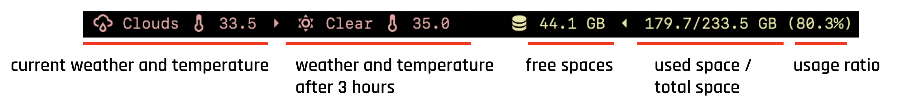
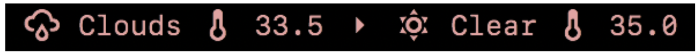
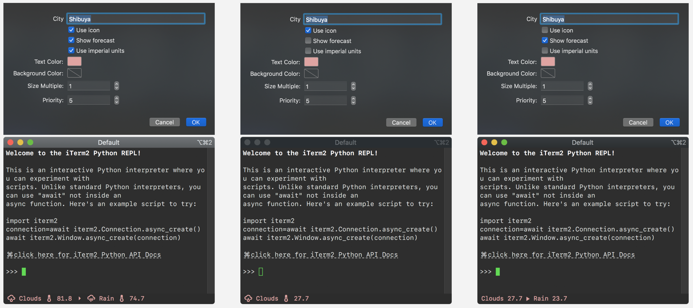
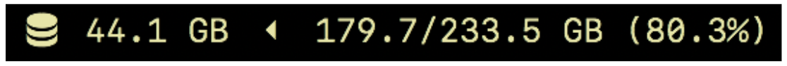

# iTerm2 Status Bar components
😎 Coooool components for iTerm2's status bar 🤟



## Components

- [x] Weather Info
- [x] Disk Usage
- [x] Clock

## Features

### Weather Info

Now you don't have to take any trouble to check the website to get weather or temperature information.



Of course, you can set your city, change the units from Celsius to Fahrenheit and configure what you like.



### Disk Usage

A useful display that helps you to get disk usage information.



You can customize the view as you like.


## Install

- Enable iTerm2's Python API.
- Install iTerm2's Python Runtime.
- (Optional) Set up the configs.
- (Optional) Using NerdFont ready font will bring you a better look.
- Run `make install-all` to install all components at once or run like `make install-weather` to just install specific component.

### Enable iTerm2's Python API

Preference Panel: **General > Magic > Enable Python API**

### Install iTerm2's Python Runtime

Menubar: **Scripts > Manage > Install Python Runtime**

### (Optional) Set up the configs

You have to register OpenWeather's account and get your API Key [here](https://home.openweathermap.org/api_keys) in case of using weather component.

Create `config.json` in the `components` directory and set

- `OpenWeatherAPIKey`: (optional) OpenWeather API key

Example:

```config.json
{
  "OpenWeatherAPIKey": "xxxxx"
}
```


### (Optional) Using NerdFont ready font will bring you a better look

These components are using a lot of glyphs from [NerdFonts](https://github.com/ryanoasis/nerd-fonts).
So use a font with Nerd Fonts will bring you a better UI.

Change font from preference panel: **Profiles > Text > Font**

### Run `make install-all`

and it copy the components to the AutoLaunch directory.

## Usage

- Activate the component from menubar: **Scripts > AutoLaunch > [component]**
- Put the component to the position you like from preference panel: **Profiles > Session > Configure Status Bar**

